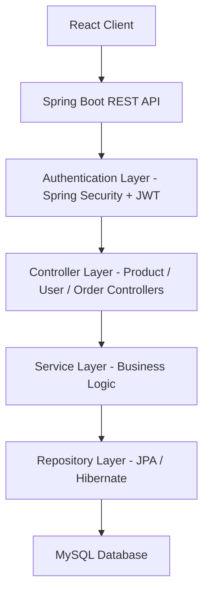

# Makeup E-Commerce Platform

Full-stack e-commerce application built with Spring Boot and React.
The platform supports secure user authentication, product browsing, and order management.

## Tech Stack

Backend
- Java
- Spring Boot
- Spring Security
- JWT Authentication
- Spring Data JPA
- MySQL

Frontend
- React
- TypeScript

## Features

- Secure user registration and login using JWT authentication
- Product catalog with REST API integration
- Role-based authorization for protected endpoints
- Structured backend architecture (Controller → Service → Repository)
- API communication between React frontend and Spring Boot backend

## Architecture

Authentication is handled using Spring Security with JWT tokens.

## API Examples

POST /api/auth/login  
Authenticates the user and returns a JWT token.

GET /api/makeup/getAll 
Returns the list of available products.

POST /api/makeup/addComment
Updates the database adding a comment to the specified makeup id.

POST /shoppingBag/addToBag
Updates the database adding the product to the shopping bag with the provided id.

## Screenshots

Login Page

Home Page

Product Page

Review Section

Shopping Cart Section

## Future Improvements

- Payment integration
- Order tracking
- Product search and filtering
